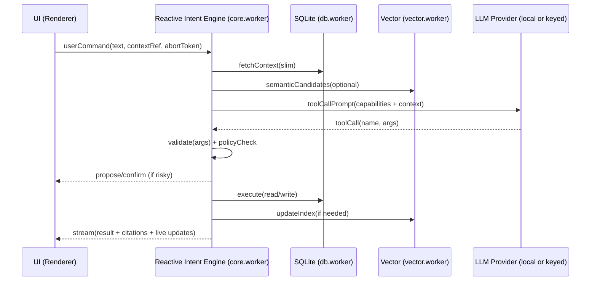

# MASTER ARCHITECTURE (v1.0): Notient — Local-First Sentient Chief of Staff
**Agent**: GPT52 (Staff/Principal Architecture Pass)  
**Date**: 2026-01-12  
**Scope**: v1.0 “Performance-First Local Intelligence Engine” inside Obsidian (Electron)

---

## North Star
Notient is not a chatbot. It is a **local intelligence engine** that continuously structures, indexes, and connects the user’s vault—then surfaces **high-value briefings** at the right time.  

**Non-negotiables**:
- **100% local data sovereignty** (no cloud storage, no external vector DBs; optional user-provided keys for LLMs).
- **UI never blocks** (no heavy parse/index/search on the renderer thread, ever).
- **Scale target**: 50,000+ notes, large indices, instant startup, predictable latency.

---

## The Core Idea: “Renderer is Glass. Intelligence is a Worker.”
The Obsidian renderer thread must be treated as a **real-time UI surface** only:
- It renders, animates, and handles input.
- It sends **commands** to the intelligence engine.
- It receives **streams of results + live updates**.

Everything else—vault scanning, metadata querying, JSON parsing, embeddings, vector search, reranking, synthesis—lives behind a hard boundary in background workers.

This directly addresses the failure modes already observed in the codebase (UI freezes from synchronous JSON parsing, vault iteration, regex passes, and sync state mutations).

---

## Tech Stack (v1.0)
This stack is chosen to maximize **throughput**, **predictable latency**, and **packaging feasibility** in an Obsidian plugin.

### Runtime + UI
- **Language**: TypeScript (ESM)
- **UI**: Preact + `@preact/signals` (already in repo; excellent for fine-grained reactivity)
- **UI virtualization**: `react-window` (works with Preact via compat) or a tiny virtual list (50k rows must be virtualized)
- **Animation (“Techno-Natural”)**: CSS + small spring lib (optional). Never animate via heavy JS loops.

### Data Layer (metadata, typed queries, text search)
- **Primary DB**: **SQLite** (single file per vault), running in a worker
- **SQLite binding** (preferred): `better-sqlite3` (fastest; synchronous API is fine because it runs off-thread)
  - Ship prebuilt binaries for Win/Mac/Linux. Provide a fallback mode if native load fails.
- **Fallback DB** (if native load is impossible): `@sqlite.org/sqlite-wasm` in a worker (slower, but functional)
- **Typed SQL**: Kysely + generated types (or Drizzle). Kysely is ideal for “typed SQL-like” query building and composability.
- **Full-text**: SQLite **FTS5** (fast local text queries, snippets, BM25)

### Vector Layer (approximate nearest neighbors)
- **ANN**: HNSW in a dedicated worker
  - Current repo uses `hnswlib-wasm` → keep for packaging simplicity, but isolate it fully in a worker.
  - If you need “million-vector class” throughput: consider a native index (e.g., `usearch`/DiskANN bindings) as an optional “Turbo Vector Engine.” v1 can ship WASM first, with a native upgrade path.
- **Hybrid retrieval**: Vector top-K → SQL filter + FTS + rerank (fast, controllable, explainable)

### Embeddings + LLM
- **Embedding providers (pluggable)**:
  - Local: Ollama, LM Studio (already in repo)
  - Optional: user-provided API keys (OpenAI/Anthropic/etc)
- **Reranking**: local model if available, else user-provided key; runs off-thread
- **Structured tool calls**: JSON schema + runtime validation (e.g., Zod). No “stringly-typed commands.”

### Concurrency + IPC
- **Workers**:
  - `core.worker`: orchestrator + scheduler + capability runtime
  - `db.worker`: SQLite (or merge into `core.worker` if simplicity needed)
  - `vector.worker`: HNSW index ops (search/insert/compact)
  - `embed.worker` (optional): isolate embedding calls / batching
- **RPC**:
  - Small custom RPC over `postMessage` (typed request/response IDs)
  - Transfer large binary payloads using **Transferables** (ArrayBuffer) to avoid copies
- **Cancellation**: `AbortController` per request end-to-end (UI → workers)

### Observability (local-first)
- **Tracing**: per-request spans (search, ingest, embed, vector, SQL, render)
- **Perf budgets** enforced in dev**: log slow queries, slow vector ops, slow renders

---

## System Architecture (Processes, Threads, Data Flow)

### 1) High-level “White House” runtime layout
```mermaid
flowchart LR
  subgraph R[Obsidian Renderer (UI Thread)]
    UI[Notient UI (Preact + signals)]
    OBS[Obsidian APIs\n(vault, metadataCache, workspace)]
  end

  subgraph W1[core.worker (Background)]
    ORCH[Reactive Intent Engine\n+ Capability Runtime]
    SCHED[Priority Scheduler\n(cooperative + cancellable)]
    SIG[Signal Engine\n(proactive briefings)]
  end

  subgraph W2[db.worker (Background)]
    DB[(SQLite: notient.db\nWAL + FTS5)]
  end

  subgraph W3[vector.worker (Background)]
    HNSW[(HNSW Index\nchunks.hnsw)]
  end

  subgraph FS[Vault Filesystem]
    MD[Markdown notes\nin vault]
    IDX[.notient/\nindex files]
  end

  UI <-->|RPC + Live Queries| ORCH
  ORCH <-->|RPC| DB
  ORCH <-->|RPC| HNSW
  OBS -->|File events| ORCH
  ORCH -->|Read/Write| MD
  DB <--> IDX
  HNSW <--> IDX
```

### 2) Threading rules (hard constraints)
- **Renderer thread**: no indexing, no DB scans, no vector search, no large JSON parsing/stringify, no vault-wide loops.
- **Workers**: all CPU-bound work, all IO batching, all parsing, all ANN operations.
- **All communications are async**: UI can show progressive results and remain responsive.

---

## 1) The Data Layer: Fast “SQL-like” metadata queries at 50k notes

### Why SQLite (for Obsidian/Electron)
SQLite is the right answer for “typed, SQL-like, local, robust, performant”:
- Single local file, ACID, mature, portable
- B-tree indexes make filters like `health < 50 AND tag = '#urgent'` fast
- FTS5 gives real text search + snippets
- WAL mode supports concurrent readers while indexing continues

### The key schema trick: typed columns + typed “meta index” tables
Frontmatter is flexible; SQL likes types. The solution is a **hybrid**:
- Put known/common fields on the `notes` table as typed columns (fast, direct indexes)
- Index arbitrary frontmatter keys into **type-specific meta tables** (fast range/equality)

**Core tables (suggested)**:
- `notes(note_id, path, title, mtime, ctime, size, hash, health, para, ...)`
- `note_tags(note_id, tag)` (indexed by `tag`)
- `note_meta_num(note_id, key, value REAL)`
- `note_meta_text(note_id, key, value TEXT)`
- `note_meta_bool(note_id, key, value INTEGER)`
- `chunks(chunk_id, note_id, ordinal, start, end, text_len, token_count, embedding_ref, ...)`
- `chunks_fts` (FTS5 virtual table; `rowid = chunk_id`)

**Indexes (must-have)**:
- `notes(path UNIQUE)`, `notes(mtime)`, `notes(health)`
- `note_tags(tag, note_id)`
- `note_meta_num(key, value, note_id)`  (range queries by key)
- `note_meta_text(key, value, note_id)` (equality)
- `chunks(note_id, ordinal)`

### Example: compile a user filter to SQL
User: `health < 50 AND tag = #urgent`

Compiled plan (conceptual):
- Candidate set A: `SELECT note_id FROM note_meta_num WHERE key='health' AND value < 50`
- Candidate set B: `SELECT note_id FROM note_tags WHERE tag = '#urgent'`
- Intersect: `A INTERSECT B`

SQLite will do this quickly with the indexes above (no vault iteration, no JS filtering).

### Typed query API
Expose a small, typed surface to the rest of the system:
- `db.searchNotes(filterExpr, sort, limit, cursor)`
- `db.getNote(note_id)`
- `db.subscribe(queryKey, params) → stream(results)`

Internally this is implemented with Kysely + compiled SQL fragments, not ad-hoc string concat.

### Startup strategy: “instant open, lazy reconcile”
On startup:
- Open DB immediately (WAL mode, tuned pragmas).
- Load a minimal manifest (last indexed mtime/hash per note).
- Show UI immediately with last-known data.
- Start a background **Vault Reconciler** that only touches changed files since last run.

**No full vault scan on startup. Ever.**

---

## 2) The Vector Layer: HNSW search that never blocks UI

### Design goals
- ANN queries must be **async** and **cancellable**
- Index updates must be incremental and bounded
- Large indices must not require “rebuild everything” on every change

### The architecture
Put ANN behind a `vector.worker` with a narrow API:
- `vector.search({ embedding, k, filterHint }) -> { ids, scores }`
- `vector.addMany([{ id, embedding }])`
- `vector.markDeleted([id])` (tombstones)
- `vector.compact()` (periodic rebuild/merge during idle)

### Critical performance detail: keep the “heavy objects” off-thread
- The HNSW structure and embedding arrays never cross into the renderer.
- When sending embeddings, use Transferables: `postMessage({buf}, [buf])`.

### Hybrid retrieval is mandatory (and makes everything faster)
Vector search alone can’t express metadata constraints well. The fast path is:
1. `vector.search` for top-K chunk IDs (K=200–1000 depending on preset)
2. `db.filterAndJoin` to enforce metadata filters + fetch note context
3. Optional: local reranker (LLM or smaller model) on the final 20–50

This approach:
- keeps ANN fast (small K)
- keeps filtering exact (SQL)
- makes results explainable (we can cite note + chunk)

---

## 3) Agent Logic: Reactive Intent Engine (capability-wired, not a bureaucratic queue)

### The mistake to avoid
A “task planner queue” becomes a microservice cosplay inside one process, and you pay in:
- latency
- state explosion
- debuggability

### The right model: Capabilities + Events + Policies
Notient is a **capability runtime**:
- Capabilities are real functions with typed schemas.
- The LLM selects a capability + arguments (tool calling).
- The runtime validates, executes, and streams results.

#### Capability Registry (conceptual)
Each capability defines:
- `id`, `description`
- input schema (JSON schema / Zod)
- risk policy: `read-only | low-risk | medium-risk | high-risk`
- required context sources (note, selection, search results)
- deterministic execution function (no hidden side effects)

Examples:
- `search_notes` (read-only)
- `open_note` (read-only)
- `propose_tag_updates` (low-risk; proposes)
- `apply_frontmatter_patch` (medium/high; requires confirmation)

### Execution flow


### Proactive intelligence (“Chief of Staff mode”)
Proactivity is event-driven, not a planner:
- Triggers: file change, time (daily briefing), user focus shift, idle time
- Signal engine computes lightweight heuristics (staleness, orphan notes, conflicting tags)
- When confidence is high, it emits a **Briefing Card** into the UI inbox

The rule: **interrupt only for high-value, high-confidence insights**.

---

## 4) Interface: Live Queries (react to DB changes in real time)

### Principle
UI state should be derived from the DB via subscriptions, not maintained via fragile ad-hoc state mutations.

### Live query contract
UI calls:
- `subscribe(queryName, params) -> { subId, initialRows }`
Worker pushes:
- `{ subId, rows, version }` when the result set changes

### Invalidation (how to know when to push)
Two workable approaches:

#### A) “Writes go through us” invalidation (recommended for v1)
All DB writes are performed by `db.worker` methods which can emit:
- `changedTables: ["notes", "note_tags"]`
- `changedNoteIds: [...]`

Subscriptions declare dependencies (coarse is fine for v1):
- “this query depends on `notes` and `note_tags`”
On change, re-run query and diff rows before pushing.

#### B) SQLite update hooks / change tables (optional)
If the binding supports it, attach update hooks; otherwise create a `change_log` table and append “what changed” in the write transaction.

### UI integration (Preact + signals)
Maintain a single `LiveQueryStore` in the renderer:
- `signals` map `subId -> rows`
- components read signals; updates are granular and cheap

Critical: throttle high-frequency streams (e.g., indexing progress) to animation frames.

---

## Vertical Slice Plan (build v1.0 without architecture envy)
Each slice must be demoable and performance-measurable.

### Slice 0 — The hard boundary (1–2 days)
- Implement worker bootstrap + typed RPC (request/response + cancellation).
- Move all heavy parsing/stringify off the renderer immediately.
- Add tracing: every RPC has duration + payload size logging.

### Slice 1 — SQLite metadata store + migrations (2–4 days)
- Add `notient.db` per vault under `.notient/`.
- Implement schema + indexes + migration runner.
- Implement ingest of note list + minimal fields (path, mtime, title, tags, frontmatter basics).
- Implement filter compiler (`health < 50 AND tag = #urgent`) → SQL.

### Slice 2 — Live query UI (2–3 days)
- `useLiveQuery()` hook + subscription protocol.
- Build a fast “Intel Table” view: filter box + virtualized list of notes.
- Verify: modify a file → DB updates → UI updates with no freeze.

### Slice 3 — Chunking + embeddings + HNSW worker (4–7 days)
- Implement chunker (deterministic, stable chunk IDs).
- Implement embedding provider (Ollama/LM Studio).
- Build HNSW index in `vector.worker` and persist under `.notient/`.
- Implement hybrid search pipeline (vector topK → SQL join → show citations).

### Slice 4 — Reactive Intent Engine + 5 core capabilities (4–7 days)
Implement capability-wired tool calling and ship these capabilities:
- `search_notes`
- `open_note`
- `summarize_note` (read-only)
- `propose_frontmatter_patch` (propose-only)
- `apply_patch` (requires explicit confirmation + writes via Obsidian API)

### Slice 5 — Proactive Briefings (3–5 days)
- Add “Briefing Inbox”
- Implement 3 signal generators (low compute):
  - stale-but-important notes (health drop)
  - orphan notes (no links, high value terms)
  - tag inconsistencies (near-duplicate tags)

---

## Performance Budgets + Guardrails (enforced)
- **Renderer long task**: target 0; any >16ms is logged with stack.
- **Search latency** (from keypress to first results): <100ms on warm cache (no rerank).
- **Indexing**: runs at low priority; yields frequently; can be paused; never blocks UI.
- **Startup**: show UI within 250ms; indexing reconciler continues in background.

---

## “Do Not Repeat Past Failures” Checklist
- No vault-wide iteration in renderer (ever).
- No synchronous JSON.parse/stringify of large payloads in renderer.
- No “microservice bureaucracy” inside a single thread.
- No JSON files as the primary query engine.
- No UI state as the source of truth for intelligence data (DB + subscriptions instead).

---

## Appendix: What to store where (local-first)
- **Vault remains canonical**: markdown files are the source of truth.
- **SQLite DB is a derivative index**: safe to rebuild; optimized for queries.
- **Vector index is a derivative index**: safe to rebuild; optimized for similarity.
- **Provenance logs**: local-only, user-visible controls, size limits, opt-in detail.

