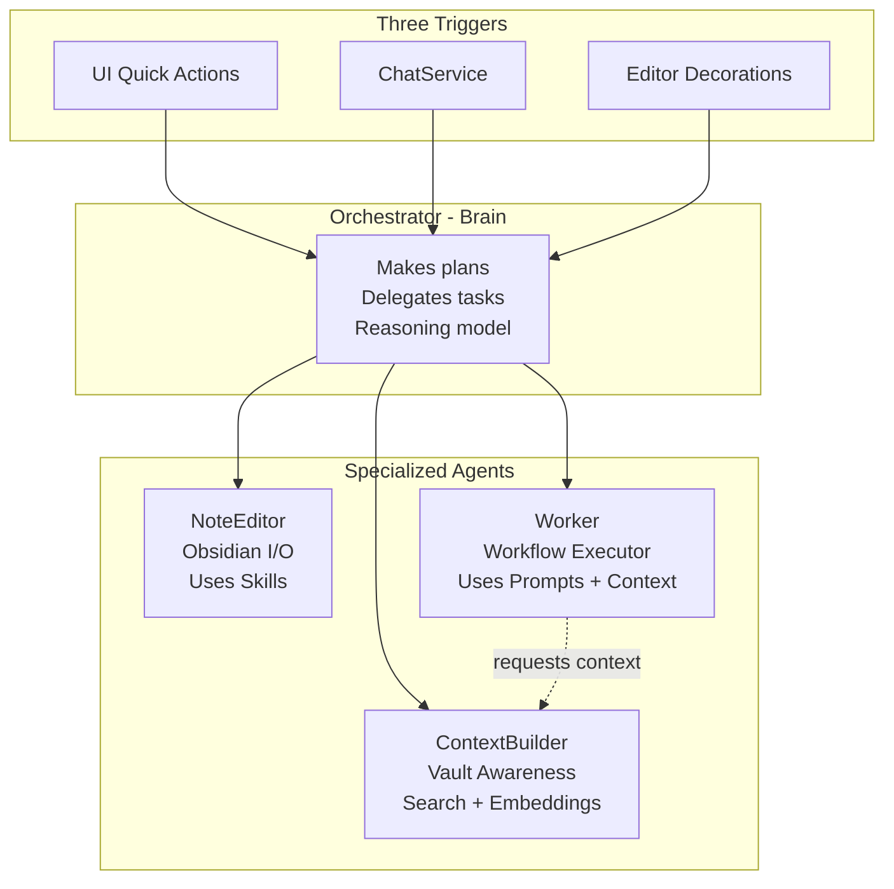

# Swarm Architecture Refactor

## Current State vs Target State

```
CURRENT (Complex)                          TARGET (Simple)
─────────────────                          ───────────────
ChiefOfStaff (router + executor)     →     Orchestrator (brain only)
ChatService (separate)               →     ChatService (hybrid trigger)
NoteEditorAgent                      →     NoteEditor Agent (enhanced)
ClassifierAgent                      →     Worker Agent (workflow)
ConnectionAgent                      →     Worker Agent (workflow)
ContextBuilderAgent                  →     ContextBuilder Agent (enhanced)
8 WorkflowAgents                     →     Worker Agent (unified)
TaskQueue (bridge)                   →     Simplified/absorbed
```

## Architecture Overview



## Implementation Phases

### Phase 1: Orchestrator Foundation (Files to modify)

Refactor [`src/core/agents/chiefOfStaff.ts`](src/core/agents/chiefOfStaff.ts) into a pure reasoning brain:

- Remove direct agent instantiation (lazy delegation instead)
- Add `AgentRegistry` for agent lookup
- Simplify to: receive request → reason about plan → delegate → aggregate results
- Remove intent detection (Orchestrator reasons, doesn't pattern-match)

Key changes:

```typescript
// NEW: Orchestrator interface
interface OrchestratorRequest {
  source: 'ui' | 'chat' | 'editor';
  intent: string;  // Natural language from user
  noteContext?: NoteContext;
  chatHistory?: ChatMessage[];
}

interface OrchestratorPlan {
  steps: Array<{
    agent: 'note-editor' | 'context-builder' | 'worker';
    task: string;
    params: Record<string, unknown>;
  }>;
  reasoning: string;
}
```

### Phase 2: Worker Agent (NEW file)

Create [`src/core/agents/workerAgent.ts`](src/core/agents/workerAgent.ts):

- Unified workflow executor (replaces 8 WorkflowAgents + ClassifierAgent + ConnectionAgent)
- Loads workflow prompts from [`src/core/intelligence/prompts/`](src/core/intelligence/prompts/)
- Can request context from ContextBuilder
- Can use Search Pipeline and Embeddings
- Executes workflows intelligently with verification

Absorb and DELETE:

- [`src/core/agents/classifierAgent.ts`](src/core/agents/classifierAgent.ts) → "classify" workflow
- [`src/core/agents/connectionAgent.ts`](src/core/agents/connectionAgent.ts) → "connect" workflow
- [`src/core/agents/workflowAgents.ts`](src/core/agents/workflowAgents.ts) → absorbed into Worker

### Phase 3: Agent Enhancements

**NoteEditor** ([`src/core/agents/noteEditorAgent.ts`](src/core/agents/noteEditorAgent.ts)):

- Add self-verification loop (check work, recover from mistakes)
- Cleaner interface for Orchestrator delegation
- Keep Skills architecture intact

**ContextBuilder** ([`src/core/agents/contextBuilderAgent.ts`](src/core/agents/contextBuilderAgent.ts)):

- Add user behavior tracking (recent edits, active note patterns)
- Add trend tracking (note clusters, topic evolution)
- Expose clean API for Worker agent to call

### Phase 4: ChatService Integration

Modify [`src/core/chat/chatService.ts`](src/core/chat/chatService.ts):

- Keep direct conversation handling
- Add `triggerOrchestrator()` method for agent tasks
- Hybrid mode: conversation OR delegation based on detected intent

### Phase 5: Cleanup & Documentation

**Delete files:**

- `src/core/agents/classifierAgent.ts`
- `src/core/agents/connectionAgent.ts`
- `src/core/agents/workflowAgents.ts`
- `src/core/agents/chatAgent.ts` (if exists, already dead)

**Update types** ([`src/core/agents/types.ts`](src/core/agents/types.ts)):

```typescript
export type AgentType = 
  | 'orchestrator'     // Brain - makes plans
  | 'note-editor'      // Obsidian I/O specialist
  | 'context-builder'  // Vault awareness specialist
  | 'worker';          // Workflow executor
```

**Update planning docs:**

- [`.claude/CLAUDE.md`](.claude/CLAUDE.md) - New architecture
- [`.planning/PROJECT.md`](.planning/PROJECT.md) - Updated requirements
- [`.planning/PHASE-UNIVERSE.md`](.planning/PHASE-UNIVERSE.md) - Add this refactor

## Key Files Summary

| Action | File | Reason |

|--------|------|--------|

| REFACTOR | `src/core/agents/chiefOfStaff.ts` | Become Orchestrator (brain only) |

| CREATE | `src/core/agents/workerAgent.ts` | Unified workflow executor |

| ENHANCE | `src/core/agents/noteEditorAgent.ts` | Add self-verification |

| ENHANCE | `src/core/agents/contextBuilderAgent.ts` | Add behavior/trend tracking |

| MODIFY | `src/core/chat/chatService.ts` | Add Orchestrator trigger |

| MODIFY | `src/core/agents/types.ts` | New agent type definitions |

| DELETE | `src/core/agents/classifierAgent.ts` | Absorbed into Worker |

| DELETE | `src/core/agents/connectionAgent.ts` | Absorbed into Worker |

| DELETE | `src/core/agents/workflowAgents.ts` | Absorbed into Worker |

## Validation Criteria

- [ ] Orchestrator receives requests from all 3 triggers
- [ ] Orchestrator makes plans without pattern-matching (uses LLM reasoning)
- [ ] NoteEditor can verify and self-correct its work
- [ ] Worker executes any workflow with context awareness
- [ ] ChatService can trigger Orchestrator for agent tasks
- [ ] No dead code (ClassifierAgent, ConnectionAgent, WorkflowAgents deleted)
- [ ] All existing workflows still work via Worker agent
