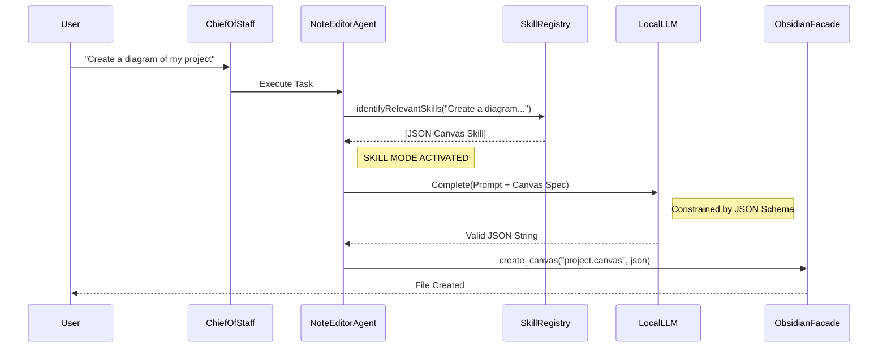

# Notient Skills Architecture

> **The Brain & Hands Model**
> How Notient safely generates complex, specialized content (Canvas, Databases) without hallucination.

## Overview

The Skills System is an architectural pattern that allows the generic `NoteEditorAgent` to "equip" specialized capabilities dynamically.

Instead of hardcoding instructions for every file format into the agent's system prompt (which wastes tokens and confuses the model), we inject **Skills** only when needed.

### Core Components

1.  **Skill Registry** (`src/core/skills/registry.ts`)
    *   The library of available capabilities.
    *   Methods to `identifyRelevantSkills(query)` based on user intent.
2.  **Skill Definition** (`src/core/skills/types.ts`)
    *   `systemPrompt`: Expert knowledge (e.g., "Here is the JSON Canvas Spec").
    *   `schema`: Strict JSON Schema (enforced by LLM provider).
3.  **Note Editor Agent** (`src/core/agents/noteEditorAgent.ts`)
    *   The *only* agent allowed to use skills.
    *   Dynamic prompt injection + Schema switching.
4.  **Obsidian Facade** (`src/adapters/obsidianFacade.ts`)
    *   The "Hands" that physically write the file.
    *   Now supports `.canvas` and `.base` file types natively.

---

## Architecture Diagram



---

## Defining a New Skill

To add a new capability (e.g., Excalidraw support), create a definition in `src/core/skills/definitions/`:

```typescript
import type { Skill } from "../types";

const EXCALIDRAW_SCHEMA = {
  // ... strict json schema ...
} as const;

export const excalidrawSkill: Skill = {
  id: "excalidraw-json",
  name: "Excalidraw Creator",
  description: "Create .excalidraw files",
  schema: EXCALIDRAW_SCHEMA,
  systemPrompt: `
# Excalidraw Skill
You are an expert at creating Excalidraw JSON...
`,
  examples: [ ... ]
};
```

 Then register it in `src/core/skills/registry.ts`.

---

## UI Integration

When an agent is using a skill, the UI reflects this state to provide transparency.

*   **Backend:** `NoteEditorAgent` emits `activeSkill` in `AgentEvent`.
*   **Frontend:** `AgentStreamsView` displays a badge (e.g., `Using Canvas Skill`) on the active agent card.

## Supported Skills (v1)

| Skill ID | Name | Output | Description |
|----------|------|--------|-------------|
| `json-canvas` | JSON Canvas | `.canvas` | Native Obsidian infinite canvas graphs. |
| `obsidian-bases` | Bases | `.base` | Database-like views (tables, boards). |
| `obsidian-markdown` | Markdown | `.md` | Advanced syntax (Callouts, Mermaid, Wikilinks). |
