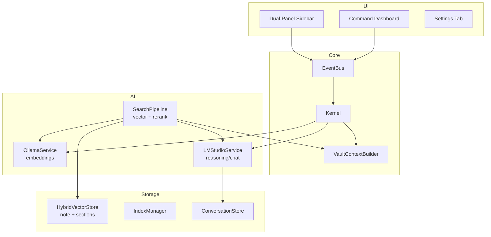

# MASTER_PLAN.md — Notient (Local-first Obsidian AI Vault Manager)

> **Version 2.0 - Architectural Reset**
> This version reflects strategic decisions made in the January 2026 architecture review.

## 0) Purpose and scope of this master plan

This document is the canonical plan for building **Notient** across multiple development phases and work sessions.

- **PRD**: `planning/PRD.md` (v2.0)
- **Code repository**: `/home/akougkas/projects/notient`

## 1) Product definition

### 1.1 Vision
Notient is a free, open-source Obsidian community plugin that provides AI-powered vault management using **local LLMs only**, combining:
- **Chat-first semantic search** with LLM reranking
- **Dynamic vault context** awareness per query
- **Agentic operations** with trust levels and universal undo
- **Human-in-steering-wheel** philosophy

### 1.2 Non-negotiables (constraints)
- **Local-only**: No cloud model APIs. No user data leaves the machine.
- **Bun-only**: Use Bun for install/build/test. No npm/yarn/pnpm workflows.
- **Language**: TypeScript strict.
- **LLM reasoning**: LM Studio (OpenAI-compatible API) - MUST BE USED (not just configured)
- **Embeddings**: Ollama (local or remote on LAN).
- **Vector Store**: Custom brute-force cosine similarity (pure JS, zero dependencies).
- **Target runtime**: Obsidian desktop (Electron). `manifest.json.isDesktopOnly = true`.
- **No debug cruft**: Console-only logging, no external telemetry.

### 1.3 Non-goals
- Mobile support (desktop-first).
- Cloud API support (OpenAI/Claude/etc).
- Real-time collaboration.
- Vault sync.
- Over-engineered undo beyond Obsidian's capabilities.

### 1.4 Success criteria (product)
- Search feels intelligent (LLM-reranked, not just similarity scores).
- Chat provides useful answers with citations.
- Agent actions respect trust levels.
- User always feels in control.

## 2) Top-level architecture

### 2.1 Runtime model (Obsidian desktop)
- Code runs in Obsidian's plugin environment (Electron renderer with Node APIs available).
- File system access and vault operations go through Obsidian APIs.

### 2.2 System decomposition (REVISED)

```
Notient Architecture v2.0
├── UI Layer
│   ├── Dual-Panel Sidebar (search + chat)
│   ├── Command-Center Dashboard
│   └── Settings Tab
│
├── Core Services
│   ├── Kernel (service orchestration)
│   ├── EventBus (typed pub/sub)
│   └── VaultContextBuilder (dynamic, per-query)
│
├── AI Services
│   ├── OllamaService (embeddings only)
│   ├── LMStudioService (reasoning, reranking, chat) ← NEW, MUST IMPLEMENT
│   └── SearchPipeline (vector + LLM rerank)
│
├── Storage Services
│   ├── HybridVectorStore (note + section embeddings) ← REVISED
│   ├── IndexManager (state tracking)
│   └── ConversationStore (chat history) ← NEW
│
└── Agent Services ← PHASE 2/3
    ├── ClassificationAgent
    ├── WorkflowRunner
    └── ActionHistory (undo support)
```

### 2.3 Key architectural decisions

| Decision | Choice | Rationale |
|----------|--------|-----------|
| Embedding granularity | Hybrid (note + sections) | Flexible retrieval, broad + precise |
| Search ranking | LLM reranking | Smarter than pure cosine similarity |
| Vault context | Dynamic per-query | More relevant than static scan |
| Primary UX | Dual panels (search + chat) | Both always visible, no mode switching |
| Agent autonomy | Trust levels | Balance automation vs control |
| Observability | Console-only | No debug telemetry, clean code |

### 2.4 Architecture diagram



## 3) Repository layout (code)

### 3.1 Source layout (REVISED)

```
src/
├── main.ts                     # Plugin entry
├── settings.ts                 # Settings tab + store
│
├── views/
│   ├── sidebar.ts              # Dual-panel (search + chat)
│   ├── searchPanel.ts          # Search results component
│   ├── chatPanel.ts            # Chat interface component ← NEW
│   └── dashboard.ts            # Command center
│
├── core/
│   ├── kernel.ts               # Service manager
│   ├── events/eventBus.ts      # Typed event bus
│   ├── context/                # Vault context ← NEW
│   │   └── vaultContextBuilder.ts
│   ├── indexer/
│   │   ├── hybridIndexer.ts    # Note + section indexing ← REVISED
│   │   └── simpleChunker.ts    # Section extraction
│   ├── search/
│   │   ├── pipeline.ts         # Vector search + LLM rerank ← REVISED
│   │   └── reranker.ts         # LM Studio reranking ← NEW
│   ├── chat/                   # Chat system ← NEW
│   │   ├── chatService.ts
│   │   └── promptBuilder.ts
│   ├── vitals/
│   └── para/
│
├── services/
│   ├── ollama.ts               # Embeddings
│   ├── lmstudio.ts             # Reasoning/chat ← MUST IMPLEMENT
│   ├── hybridVectorStore.ts    # Note + section storage ← REVISED
│   ├── indexManager.ts
│   ├── conversationStore.ts    # Chat history ← NEW
│   ├── healthMonitor.ts
│   ├── storagePaths.ts
│   └── vaultLock.ts
│
├── agents/                     # Phase 2/3 ← NEW
│   ├── classifier.ts
│   ├── workflowRunner.ts
│   └── actionHistory.ts
│
├── adapters/
│   └── obsidianFacade.ts
│
└── types/
    ├── settings.ts
    ├── events.ts
    ├── search.ts
    ├── chat.ts                 # ← NEW
    └── agents.ts               # ← NEW
```

### 3.2 Data layout (on disk)

```
{vaultRoot}/.obsidian/plugins/notient/
├── data.json                   # Plugin settings
├── index-{modelKey}.json       # Hybrid embeddings (notes + sections)
├── state-{modelKey}.json       # Index state
├── conversations.json          # Chat history (optional persistence)
├── action-history.json         # Agent action log for undo
├── cache/                      # LRU caches
└── locks/                      # Multi-window safety
```

## 4) Core services

### 4.1 LMStudioService (NEW - CRITICAL)

**This service MUST be implemented.** Currently LM Studio is configured but never called.

```typescript
interface LMStudioService {
  // Health & status
  isAvailable(): Promise<boolean>;
  listModels(): Promise<string[]>;

  // Reasoning operations
  rerank(query: string, candidates: SearchResult[]): Promise<RankedResult[]>;
  classify(note: NoteContent): Promise<Classification>;
  chat(messages: ChatMessage[], context: VaultContext): Promise<ChatResponse>;

  // Streaming support
  chatStream(messages: ChatMessage[], context: VaultContext): AsyncIterable<string>;
}
```

### 4.2 VaultContextBuilder (NEW)

Builds dynamic context per query (not static scan):

```typescript
interface VaultContextBuilder {
  // Build context relevant to a specific query
  buildForQuery(query: string, candidates: SearchResult[]): VaultContext;

  // Context includes:
  // - Relevant folder paths from candidates
  // - Active tags in candidate notes
  // - Link graph fragment (1-hop from candidates)
  // - PARA distribution of candidates
  // - Recent modifications in relevant areas
}
```

### 4.3 HybridVectorStore (REVISED)

Stores both note-level and section-level embeddings:

```typescript
interface HybridEmbedding {
  noteId: string;
  path: string;
  title: string;

  // Note-level embedding (whole content)
  noteEmbedding: number[];
  noteHash: string;

  // Section-level embeddings (chunks)
  sections: Array<{
    sectionId: string;
    heading: string;
    text: string;
    embedding: number[];
  }>;

  // Metadata
  mtimeMs: number;
  tags: string[];
  frontmatter: Record<string, unknown>;
}
```

### 4.4 SearchPipeline (REVISED)

Two-phase search with LLM reranking:

```typescript
interface SearchPipeline {
  search(query: string, options: SearchOptions): Promise<SearchResult[]>;

  // Phase 1: Vector search (fast, top-50)
  // Phase 2: LLM reranking (smart, final top-K)
  // Phase 3: Build dynamic context for chat
}
```

## 5) UI architecture

### 5.1 Dual-Panel Sidebar

```
┌─────────────────────────────────┐
│ [Search Panel - 40%]            │
│ ┌─────────────────────────────┐ │
│ │ 🔍 [Search input...]        │ │
│ │                             │ │
│ │ Results (LLM-reranked):     │ │
│ │ • Note A - "relevant because"│ │
│ │ • Note B - "matches topic"  │ │
│ │ • Note C - "similar content"│ │
│ └─────────────────────────────┘ │
├─────────────────────────────────┤
│ [Chat Panel - 60%]              │
│ ┌─────────────────────────────┐ │
│ │ 💬 Chat with your vault     │ │
│ │                             │ │
│ │ [Message history...]        │ │
│ │                             │ │
│ │ AI: Based on your notes...  │ │
│ │     [Citation 1] [Cite 2]   │ │
│ │                             │ │
│ │ [Ask a question...]     [⏎] │ │
│ └─────────────────────────────┘ │
└─────────────────────────────────┘
```

### 5.2 Dashboard (Command Center)

```
┌────────────────────────────────────────────────────┐
│ NOTIENT DASHBOARD                                  │
├────────────────────────────────────────────────────┤
│                                                    │
│ [Vault Vitals]          [Agent Actions]           │
│ ┌──────────────┐        ┌──────────────────┐      │
│ │ Health: 87%  │        │ Available:       │      │
│ │ Notes: 1,234 │        │ • Process Inbox  │      │
│ │ Orphans: 23  │        │ • Find Duplicates│      │
│ │ Inbox: 15    │        │ • Batch Classify │      │
│ └──────────────┘        └──────────────────┘      │
│                                                    │
│ [Action History]                                   │
│ ┌──────────────────────────────────────────┐      │
│ │ Today:                                   │      │
│ │ • Tagged 5 notes with #project  [Undo]   │      │
│ │ • Moved 3 notes to Archive      [Undo]   │      │
│ │ Yesterday:                               │      │
│ │ • Linked 12 related notes       [Undo]   │      │
│ └──────────────────────────────────────────┘      │
│                                                    │
│ [Index Status]                                     │
│ Model: nomic-embed-text (384d) | Notes: 1,234/1,250│
│ [Sync] [Rebuild] [Export]                         │
└────────────────────────────────────────────────────┘
```

## 6) Agent autonomy model

### 6.1 Trust levels

| Level | Risk | Actions | Behavior |
|-------|------|---------|----------|
| **Low** | Reversible, metadata-only | Add/remove tags, update frontmatter | Auto-apply, log to history |
| **Medium** | Structural changes | Move notes, create links, rename | Confirm dialog, one-click approve |
| **High** | Destructive/lossy | Merge, archive, delete | Warning + explicit confirmation |

### 6.2 Workflow types

```typescript
type WorkflowScope =
  | { type: "note", path: string }           // Process single note
  | { type: "folder", path: string }         // Process folder (batch)
  | { type: "vault" }                        // Full vault operation
  | { type: "selection", paths: string[] };  // Selected notes
```

### 6.3 Undo philosophy

- Use Obsidian's native undo where possible (file content changes)
- Track structural changes (moves, renames) in `action-history.json`
- Dashboard shows recent actions with undo buttons
- No over-engineering: if Obsidian can't undo it natively, warn before action

## 7) Phased roadmap

### Phase 1.5: ARCHITECTURAL RESET (Current Priority)

**Goal:** Transform from broken search MVP to intelligent assistant foundation.

**Critical fixes:**
1. Remove all debug telemetry (3 locations)
2. Fix dual note ID generation bug (IndexManager vs Chunker)
3. Implement LMStudioService (actual API calls, not just config)

**New capabilities:**
4. Hybrid embedding storage (note + sections)
5. LLM-based search reranking
6. Dynamic vault context builder
7. Dual-panel sidebar (search + chat)
8. Basic chat interface with RAG

**Exit criteria:**
- Search returns LLM-reranked results with reasoning
- Chat answers questions using retrieved context
- No debug code in codebase
- Clean console-only logging

### Phase 2: Intelligence

**Capabilities:**
- Multi-pass processing (classify → enrich → link)
- Inbox triage workflow
- Suggested tags/links with preview
- Background classification

**Exit criteria:**
- Inbox notes get classification suggestions
- User can batch-review suggestions
- Suggestions are previewable and safe

### Phase 3: Agentic

**Capabilities:**
- Trust-level agent actions
- Workflow runner (note/folder/vault scope)
- Action history with undo
- Dashboard as command center

**Exit criteria:**
- Low-risk actions auto-apply
- Medium/high-risk actions confirm
- Undo works for tracked actions

### Phase 4: Polish

**Capabilities:**
- Smart Connections migration
- Performance optimization
- Community release packaging
- Advanced visualizations

## 8) Implementation session guide

### Session: ARCHITECTURAL RESET

**Objective:** Execute Phase 1.5 in one comprehensive session.

**Sequence:**

1. **Clean house** (30 min)
   - Remove debug telemetry from 3 files
   - Fix note ID generation in IndexManager
   - Clean up console logging

2. **LMStudioService** (2 hours)
   - Implement service class with OpenAI-compatible API
   - Add rerank(), chat(), chatStream() methods
   - Wire into kernel service registry

3. **Hybrid storage** (1.5 hours)
   - Modify vector store schema for note + section embeddings
   - Update indexer to generate both levels
   - Maintain backward compatibility (migration)

4. **Search reranking** (1 hour)
   - Modify pipeline to do vector top-50 → LLM rerank
   - Add reranking prompt template
   - Return results with reasoning

5. **Vault context** (1 hour)
   - Implement VaultContextBuilder
   - Dynamic context from search candidates
   - Inject into LM prompts

6. **Dual-panel UI** (2 hours)
   - Redesign sidebar with search + chat panels
   - Implement chat message history
   - Wire RAG pipeline (search → context → LM → response)

7. **Testing & polish** (1 hour)
   - Manual testing on real vault
   - Fix obvious issues
   - Update docs

**Total estimated:** 9 hours

## 9) Risk register

### Critical (must address in Phase 1.5)
- ❌ Debug telemetry shipping to production
- ❌ LM Studio configured but never used
- ❌ Dual note ID generation causes data corruption

### High (address soon)
- ⚠️ Search results are meaningless similarity scores
- ⚠️ No vault awareness in LLM context
- ⚠️ No chat interface despite competition having it

### Medium (Phase 2+)
- Agent actions without trust levels
- No undo for structural changes
- Missing inbox triage workflow

## 10) Decision log

| Date | Decision | Rationale |
|------|----------|-----------|
| 2026-01-06 | Hybrid embeddings (note + sections) | Flexible retrieval, broad + precise |
| 2026-01-06 | LLM reranking over pure cosine | Smarter results, competitive with SC v4 |
| 2026-01-06 | Dynamic context per query | More relevant than static vault scan |
| 2026-01-06 | Dual-panel sidebar | Search + chat always visible |
| 2026-01-06 | Trust levels for agents | Balance automation vs user control |
| 2026-01-06 | Remove all debug telemetry | Clean code, no data leaks |
| 2026-01-06 | Full architectural reset | Comprehensive fix over incremental patches |

---

*Last updated: 2026-01-06*
*Author: Anthony Kougkas*
*Version: 2.0 (Architectural Reset)*
