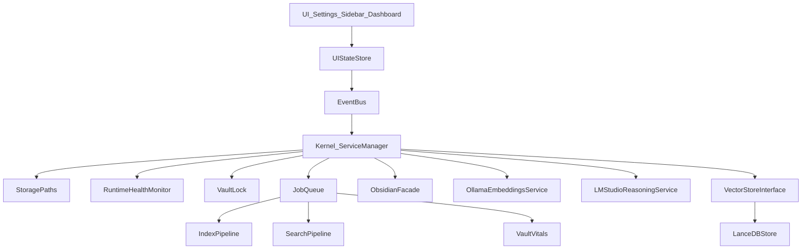

# MASTER_PLAN.md — Notient (Local-first Obsidian AI Vault Manager)

## 0) Purpose and scope of this master plan
This document is the canonical plan for building **Notient** across multiple development phases and work sessions.

- **Inputs**:
  - PRD: [/home/akougkas/.cursor/worktrees/notient__WSL__ubuntu-24.04_/dva/PRD.md](/home/akougkas/.cursor/worktrees/notient__WSL__ubuntu-24.04_/dva/PRD.md)
  - Bootstrap prompt (to be updated to match this master plan): [/home/akougkas/.cursor/worktrees/notient__WSL__ubuntu-24.04_/dva/planning/prompts/bootstrap.md](/home/akougkas/.cursor/worktrees/notient__WSL__ubuntu-24.04_/dva/planning/prompts/bootstrap.md)
- **Code repository location** (execution target): `/home/akougkas/projects/notient` (aka `~/projects/notient`).

## 1) Product definition
### 1.1 Vision
Notient is a free, open-source Obsidian community plugin that provides AI-powered vault management using **local LLMs only**, combining **fast semantic search**, **incremental note processing**, **vault health monitoring**, and an **agentic UI** that can perform vault operations **with user confirmation**.

### 1.2 Non-negotiables (constraints)
- **Local-only**: No cloud model APIs. No user data leaves the machine.
- **Bun-only**: Use Bun for install/build/test. No npm/yarn/pnpm workflows.
- **Language**: TypeScript strict.
- **LLM reasoning**: `@lmstudio/sdk`.
- **Embeddings**: `ollama` JS library (local host only).
- **Vector DB**: `@lancedb/lancedb`.
- **Target runtime**: Obsidian desktop (Electron). Set `manifest.json.isDesktopOnly = true`.

### 1.3 Non-goals
- Mobile support (desktop-first).
- Cloud API support (OpenAI/Claude/etc).
- Real-time collaboration.
- Vault sync.

### 1.4 Success criteria (product)
- Search feels instant in steady state.
- Vault vitals create a daily/weekly “why” to open the dashboard.
- Agentic operations are safe: no unconfirmed writes.

## 2) Top-level architecture
### 2.1 Runtime model (Obsidian desktop)
- Code runs in Obsidian’s plugin environment (Electron renderer with Node APIs available).
- File system access and vault operations go through Obsidian APIs; absolute vault path is obtained via desktop file system adapter.

### 2.2 System decomposition
Notient is structured around:
- **UI layer**: Settings tab + Sidebar view + Dashboard view.
- **Core orchestration**: Kernel/ServiceManager, event bus, background queue.
- **Domain pipelines**: indexing, semantic search, vault vitals.
- **Integrations**: LM Studio, Ollama, LanceDB.

### 2.3 Key cross-cutting requirements
- **Degraded mode**: plugin always loads; features disable gracefully when dependencies fail.
- **Non-blocking UI**: indexing and heavy work must not freeze the renderer.
- **Crash-safe**: queue and index state survive restarts.
- **Multi-window safety**: protect LanceDB + writes with a lock.
- **Upgradeable**: settings schema versioning; data migrations; model switching.

### 2.4 Architecture diagram

## 3) Repository layout (code)
Repo root: `/home/akougkas/projects/notient`

### 3.1 Source layout
Maintain PRD layout and add a small set of “foundation” modules:

- `src/main.ts` — plugin entry
- `src/settings.ts` — settings tab UI + settings store
- `src/views/sidebar.ts` — sidebar view
- `src/views/dashboard.ts` — dashboard view

- `src/core/kernel.ts` — service manager + lifecycle
- `src/core/events/eventBus.ts` — typed event bus
- `src/core/queue/jobQueue.ts` — persistent queue
- `src/core/indexer/` — indexing pipeline
- `src/core/search/` — semantic search
- `src/core/vitals/` — vault vitals
- `src/core/para/` — PARA detection and note typing

- `src/services/storagePaths.ts` — compute plugin data directories
- `src/services/healthMonitor.ts` — dependency probing + status events
- `src/services/ollama.ts` — embeddings client wrapper
- `src/services/lmstudio.ts` — LM Studio client wrapper
- `src/services/vectorStore.ts` — interface + domain model
- `src/services/lancedb.ts` — LanceDB implementation
- `src/services/vaultLock.ts` — multi-window lock

- `src/adapters/obsidianFacade.ts` — wrappers for App/Vault/Workspace
- `src/types/` — shared types (settings, events, models)

### 3.2 Data layout (on disk)
Under `{vaultRoot}/.obsidian/plugins/notient/`:

- `data.json` — plugin settings
- `cache/` — ephemeral caches (search results, query embeddings)
- `processing-queue/` — persistent job queue
- `lancedb/` — vector DB storage
- `locks/` — lockfiles
- `logs/` — optional local logs (debug only)

## 4) Core abstractions
### 4.1 SettingsStore
- Loads/saves `data.json` via Obsidian plugin data APIs.
- Exposes typed settings + validation results.
- Supports schema versioning and migration of settings.

**Validation policy**:
- Never block plugin load.
- Mark capabilities as unavailable with actionable error text.

### 4.2 StoragePaths
- Resolves the absolute vault root path (desktop-only).
- Computes and ensures plugin data directories exist.
- Provides a single source of truth for any disk paths.

### 4.3 Kernel / ServiceManager
Single owner of:
- Initialization order
- Shutdown/unload cleanup
- Shared cancellation / abort
- Capability registry (what features are enabled right now)

**Lifecycle shape**:
- Constructors are sync.
- `initialize(ctx)` is async.
- `dispose()` is sync/async safe and idempotent.

### 4.4 EventBus
Typed pub/sub channel for:
- Health changes
- Queue changes
- Indexing progress
- Search status
- Vitals refresh

### 4.5 JobQueue (persistent)
- Queue stored under `processing-queue/`.
- Crash-safe: jobs in `in_progress` revert to `pending` on startup.
- Retry strategy: bounded attempts + exponential backoff metadata.

### 4.6 ObsidianFacade
A thin wrapper interface around Obsidian APIs used by core logic:
- Reading note contents
- Listing markdown files
- Workspace interactions
- UI notifications

This allows `bun test` for core modules without Obsidian.

## 5) Dependency integrations
### 5.1 LM Studio (reasoning)
- Use `@lmstudio/sdk`.
- Capabilities:
  - model detection/listing
  - chat completions (streaming optional)
  - embeddings may exist but Notient uses Ollama for embeddings per PRD

### 5.2 Ollama (embeddings)
- Use `ollama` library.
- Restrict to local host by default (`http://127.0.0.1:11434`).
- Use `embed({ model, input, truncate?, keep_alive? })`.
- Support custom `fetch` if needed in Obsidian runtime.

### 5.3 LanceDB (vector store)
- Use `@lancedb/lancedb`.
- Treat as **native module** (napi-rs). In dev-alpha:
  - keep as runtime dependency
  - externalize from bundling so it loads from `node_modules`

## 6) Data model and persistence
### 6.1 Stable identifiers
- `noteId`: stable id derived from normalized vault path.
- `chunkId`: stable id derived from `(noteId, chunkIndex, chunkHash)`.
- `modelKey`: stable key derived from embedding model identity + dimension.

### 6.2 Index state
Maintain an index state store to avoid re-embedding unchanged notes:

- Per note:
  - `path`
  - `mtimeMs`
  - `sizeBytes`
  - `contentHash`
  - `chunkCount`
  - `lastEmbeddedAt`
  - `modelKey`
  - `status` + `lastError`

Storage location:
- persisted as JSON in `processing-queue/` or a dedicated `index-state.json` (implementation choice), but must be crash-safe and atomic.

### 6.3 LanceDB schema (minimum viable)
A single primary table per modelKey:
- `chunks` table fields:
  - `chunkId` (string, primary)
  - `noteId` (string)
  - `path` (string)
  - `title` (string, optional)
  - `headingPath` (string[], optional)
  - `chunkIndex` (number)
  - `text` (string)
  - `embedding` (vector<float>)
  - `mtimeMs` (number)
  - `contentHash` (string)
  - `tags` (string[], optional)
  - `frontmatter` (json-ish, optional)

Optional tables later:
- `notes` table (note-level aggregates)
- `links` table (graph)

### 6.4 Model switching / dimension mismatch
Strategy:
- Scope DB directories by modelKey:
  - `lancedb/<modelKey>/...`
- On model change:
  - create new DB
  - enqueue background reindex
  - keep old DB for rollback

### 6.5 Caches
- Query embedding cache (bounded LRU)
- Search results cache (bounded LRU; keyed by `(query, filters, modelKey)`)

## 7) Indexing pipeline
### 7.1 Ingestion sources
- Startup scan: enumerate markdown files.
- Vault events: `create`, `modify`, `rename`, `delete`.

### 7.2 Pipeline stages
- Discover candidates
- Read contents
- Chunk (configurable chunk size/overlap)
- Compute hashes
- Embed via Ollama
- Upsert into vector store
- Update index state

### 7.3 Non-blocking execution
- Use a queue worker that time-slices (process N items then yield).
- Avoid heavy work inside event handlers.
- Optionally introduce Node `worker_threads` later if needed; keep abstractions so it can move.

### 7.4 Failure handling
- Per-job errors recorded and surfaced in UI.
- Retriable errors vs permanent errors.
- Abort on unload.

## 8) Semantic search pipeline
### 8.1 MVP behavior
- Embed query
- Vector search in LanceDB
- Return topK chunks; group by note; show snippets in sidebar

### 8.2 Hybrid cache architecture (PRD speed differentiator)
- Immediate response:
  - if cached results exist → return <100ms target
  - else quick vector search → aim <500ms
- Async refinement:
  - rerank/group/expand context
  - update UI incrementally

### 8.3 Filters (gradual)
- Note type (PARA)
- Folder/path
- Tags
- Date ranges

## 9) Vault Vitals
### 9.1 MVP vitals (Phase 1)
- note count
- inbox size
- orphan count (no links)
- processing queue length

### 9.2 Expanded vitals (Phase 2+)
- freshness / decay warnings
- connectivity hubs/clusters
- coverage gaps (topic modeling / embedding clustering)
- suggestions counts + acceptance rate

## 10) PARA note type system
### 10.1 Detection
- Path-based defaults:
  - Inbox: `0-inbox/`
  - Projects: `1-projects/`
  - Areas: `2-areas/`, `3-areas/`
  - Resources: `2-knowledge/`
  - Archive: `4-archive/`
- Allow user mapping overrides.

### 10.2 Usage
- Drives sidebar behaviors and default suggestions.

## 11) Agentic capabilities (with confirmation)
### 11.1 Principle
AI suggests; human approves. No silent modifications.

### 11.2 Tool system design
- Define tools as pure functions over a “proposed change” model:
  - tag additions
  - frontmatter edits
  - link insertions
  - move/merge/archive/delete
- UI shows a diff/preview; user confirms; then apply via Obsidian APIs.

### 11.3 Phase gating
- Phase 1: read-only suggestions
- Phase 3: write operations + confirmations

## 12) UI architecture
### 12.1 Views
- **Sidebar**: context-aware panels + search + quick vitals
- **Dashboard**: Vault Vitals + batch operations + settings surface

### 12.2 State management
- UI subscribes to EventBus.
- A `UIStateStore` holds:
  - health status
  - indexing progress
  - queue status
  - last search results
  - current note context

### 12.3 Degraded mode UX
- Show capability badges (Ollama/LMS/LanceDB) with status.
- Provide “Fix” hints (host URL, model name, start service).

### 12.4 Theme awareness
- Use Obsidian CSS variables.
- Keep styling minimal; avoid hard-coded colors.

## 13) Concurrency, locking, and lifecycle
### 13.1 Multi-window concurrency
- Acquire a lockfile under `locks/`.
- If lock acquisition fails:
  - disable DB writes + indexing
  - allow read-only search if DB can be opened safely (or disable LanceDB entirely if unsafe)

### 13.2 Plugin unload cleanup
- Abort in-flight work
- Stop timers
- Close DB connections/file handles
- Flush queue/index state

## 14) Developer workflow (fast inner loop)
### 14.1 Scripts
- `bun install`
- `bun run build` → emits `main.js`
- `bun run dev` → `bun build --watch` + sync outputs into an Obsidian dev vault plugin folder

### 14.2 Debugging
- Use Obsidian dev tools console
- Structured logging with log levels (debug/info/warn/error)

## 15) Testing strategy
### 15.1 Unit tests (Bun)
- Core logic: PARA detection, chunking, hashing, queue transitions, settings validation
- Use `ObsidianFacade` mocks

### 15.2 Integration tests (local)
- Optional harness that runs against a fixture vault
- Smoke tests for indexing/search

### 15.3 Performance benchmarks
- Measure:
  - indexing throughput
  - query latency cached/uncached
  - memory footprint trends

## 16) Packaging and releases
### 16.1 Dev-alpha (now)
- Manual install flow.
- `node_modules` can be shipped inside plugin folder.
- Accept that native modules are platform-bound.

### 16.2 Community release (later)
Because Obsidian plugin installs do not run `npm install`, we must ship runtime deps with the plugin release.

Planned options (evaluate in Phase 4):
- Platform-specific release artifacts (one zip per OS/arch) bundling the correct LanceDB native binary.
- Multi-platform bundle with per-platform binaries + runtime selection.
- Optional binary downloader at first run (with user confirmation) if acceptable.

## 17) Phased roadmap with exit criteria
### Phase 0 — Bootstrap foundation
Exit criteria:
- Repo compiles, plugin loads, settings tab renders
- Kernel/Services/EventBus/Paths/Queue/Lock scaffolding exists

### Phase 1 — Core MVP (PRD Phase 1)
Capabilities:
- Setup wizard (minimal): detect LM Studio/Ollama availability, select embedding model
- Initial indexing with progress
- Sidebar semantic search command
- Related notes panel (basic)
- Basic Vault Vitals (note count, inbox size, orphan count, queue length)
- PARA detection

Exit criteria:
- Index and search works end-to-end on a 500+ note vault
- Degraded mode works (turn off Ollama/LMS and UI explains)

### Phase 2 — Intelligence
Capabilities:
- Multi-pass processing (classify → enrich → link) as queued jobs
- Suggestions for tags/links
- Context-aware sidebar panels
- Full Vault Vitals dashboard

Exit criteria:
- Batch queue is reliable across restarts
- Suggestions are previewable and safe

### Phase 3 — Agentic
Capabilities:
- Tool-based agent with confirmation UI
- Vault operations: move/merge/archive/delete behind confirm
- Automation rules (opt-in)

Exit criteria:
- No silent writes
- Robust diff/preview and undo-friendly operations

### Phase 4 — Polish
Capabilities:
- Smart Connections migration wizard
- Advanced visualizations
- Performance optimizations
- Packaging strategy finalized for community releases

Exit criteria:
- Release-ready artifacts, docs, migration experience

## 18) Session-based execution model
Each dev session should produce:
- a shippable increment (even if dev-alpha)
- updated docs/ADR entries
- updated tests for new core behaviors

Recommended early sessions:
- **Session A**: Phase 0 repo bootstrap + kernel + paths + lock + minimal UI
- **Session B**: queue + indexing skeleton + status UI
- **Session C**: Ollama embeddings + LanceDB upsert + minimal semantic search
- **Session D**: vitals MVP + PARA detection + event wiring
- **Session E**: onboarding wizard + model selection + reindex flow

## 19) Risk register (must be tracked continuously)
- Native module loading and path resolution (LanceDB)
- Service initialization order and lazy init
- Runtime health signaling and degraded mode UX
- Storage paths cross-platform correctness
- Plugin unload cleanup
- Settings validation policy
- Testing seams without Obsidian
- Vault event debouncing + queueing
- Dev inner loop speed
- Renderer blocking avoidance
- Multi-window DB locking
- Networking quirks (fetch/CORS)
- Queue crash recovery
- Memory bounds for large vaults
- Packaging strategy for community release

## 20) Decision log (ADR cadence)
Create ADRs for:
- Build/bundling strategy with Bun for Obsidian
- LanceDB native dependency and distribution plan
- Embedding model switching strategy (modelKey + DB scoping)
- Degraded-mode capability model
- Queue format and crash recovery semantics